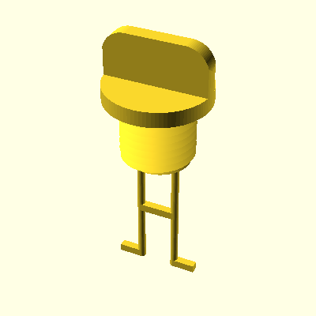

# Laser 16 Boat Parts

This repository is an experimental collection of Laser 16 boat parts to be 3D printed or manufactured in other ways. Use it at your own risk. At the moment it contains Laser 16 bung and socket for 3D printing or other manufacturing methods if you wish.

The o-ring is supposed to be cast out of silicone, that is why there is a mold. The fastest way to do it is to 3D print the mold (FDM + PLA) and mix small amount of rather less flexy silicone and thickener. Use a spatula or similar tool to smear the silicone paste into the mold. Wait.

<table>
<tr>
<td></td>
<td></td>
<td></td>
<td></td>
</tr>
<tr align="center">
<td>bung.scad</td>
<td>socket.scad</td>
<td>oring.scad</td>
<td>mold.scad</td>
</tr>
</table>

## Usage

You can download the 3D models from the Releases section. Pick a release and look for the Assets. Click on `stls`, it will initiate a download. Unzip the file and you will find the 3D mesh files that you can then use for manufacturing.

3D models are generated automatically once changes are pushed to the repository. If you want to very latest 3D models, look under the Actions tab of the repository.

If you want to generate the 3D files using [OpenSCAD](https://openscad.org/) yourself, the repository should be initialized with submodules. The following commands will init and update them.

```
git submodule init
git submodule update
```

Threads in the design make use of the [spiral_extrude](https://www.thingiverse.com/thing:1958354/apps) module by AKADAP. It has been added as a submodule and if you follow the instructions above, it should be cloned along with this repository.

## Contributing

After making changes to the code you might want to submit a pull request. One task to do before is to update images. You can use the `imgen.sh` script to do that for you (sorry, only Linux and maybe Mac).

```
chmod a+x imgen.sh
./imgen.sh
```

This will generate new images in the `images` directory. These are used in the `README.md` file that you are currently reading.

## About Laser 16

Designed by Bruce Kirby of Laser racing dinghy fame, the 16 is a very different sort of boat. Five metres in length with a 2m beam, the gel-coated glass fibre dinghy first appeared in 1986 under the 'Laser Weekend' tag which signalled the sort of family-and-friends market it was aimed at. A retractable 29.5kg metal centreboard makes a significant contribution to the overall 250kg hull weight and to the boat's feeling of solidity and stability. It has a sizeable watertight storage locker under the enclosed foredeck, accessible via a lifting hatch on the forward bulkhead. A furling jib and two rows of mainsail slab reefing are standard. Buoyancy is built into the bow and enclosed side decks, while the cockpit is self-draining via holes in the full-height transom. Options included a rear locker, outboard bracket, swim ladder and symmetric spinnaker kit. Production of the Laser 16 ceased in the late 1990s but it is still very popular with families and day cruising aficionados, and can easily accommodate five adults.

Source: [newtosailing.com](http://www.newtosailing.com/classes/view.asp?id=42)

## License

[](https://creativecommons.org/licenses/by-sa/3.0/)

This work is licensed under a [Creative Commons Attribution-ShareAlike 3.0 Unported License](https://creativecommons.org/licenses/by-sa/3.0/).
